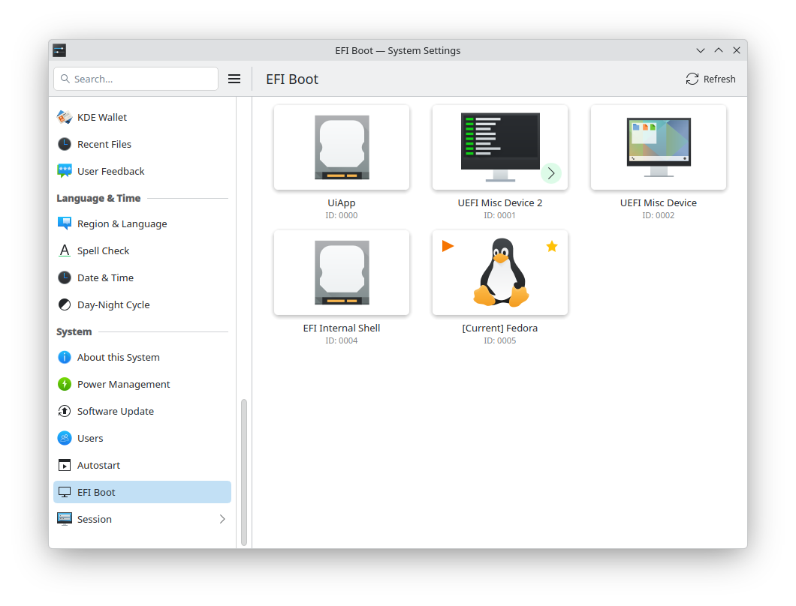

# EFI Boot Manager KCM

A KDE Configuration Module (KCM) for managing EFI boot entries.



## Features

This contains basic features:

- View all EFI boot entries with visual icons
- Set the default boot entry
- Set the next boot entry (one-time boot)
- Integrated with KDE Plasma System Settings

To manage the EFI entries as an advanced user, please use [QEFI Entry Manager](https://github.com/Inokinoki/QEFIEntryManager).

## Requirements

- Qt6 >= 6.9.0
- KDE Frameworks 6 >= 6.18.0
- EFI-capable system with efivarfs support

## Building

```bash
mkdir build && cd build
cmake ..
make
sudo make install
```

## Usage

After installation, find "EFI Boot" in System Settings under the System Administration category.

## License

GPL-2.0-or-later
